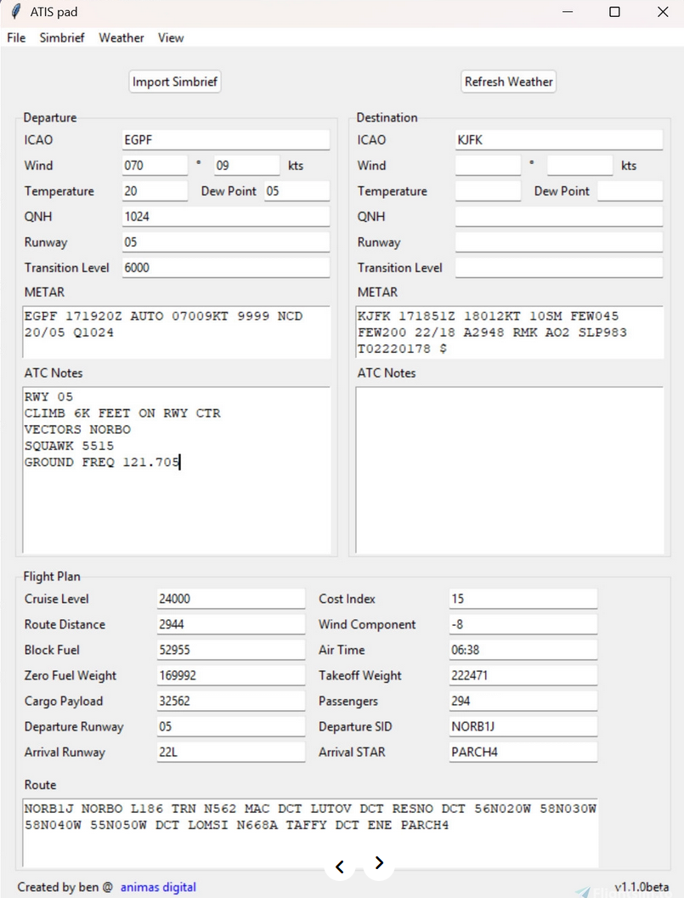

# FlyPad-rs

Creating a basic project inspired by <https://flightsim.to/file/92709/atis-pad-scratchpad-utility-app-for-atc-weather-data>

The goal of this project is to build an application while learning how to use Slint with Rust  

## Minimum Features

This needs to be able to:

- [ ] Allow user to set their simbrief ID
- [ ] Import data from Simbrief
  - [ ] Departure and Arrival Airport
  - [ ] Flight Data
    - Route
    - Cost Index
    - Route Distance
    - Expected Departure and Arrival Runway
    - SID and STAR
    - Block Time
    - Air Time
  - [ ] Weights
    - Block Fuel
    - Zero Fuel Weight
    - Payload
    - Passenger number
    - Takeoff Weight
- [ ] Allow user to refresh the weather
  - Wind direction and speed
  - Temperature and dew point
  - QNH
  - Populate Runway and transition levels from Simbrief data
  - METAR
- [ ] Provide a box for ATC Notes
